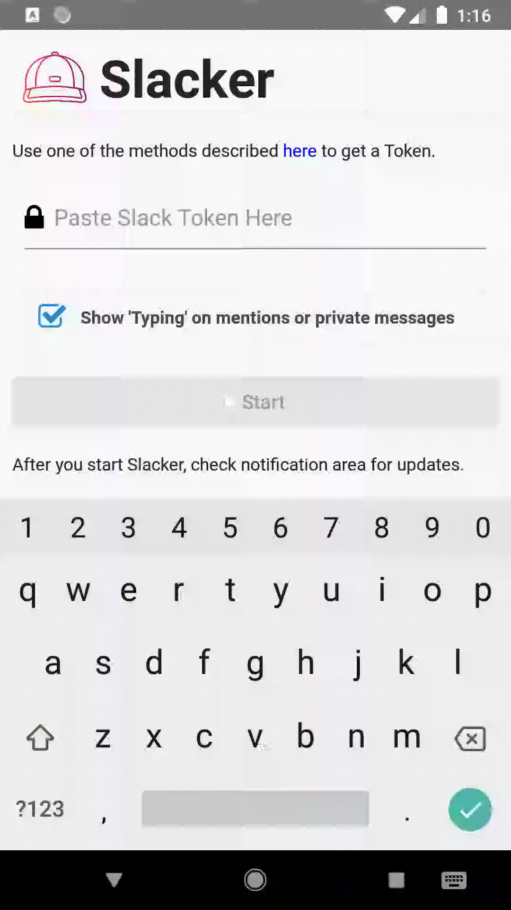

Slacker
=======



React Native Android application that uses a background task to keep your slack presence active.

### Features:
- Send fake 'User is typing' when you get a private message or you are mentioned in a channel.
- Pressing on a message from the log viewer will open the message channel in Slack client or Slack Web client.

## Development

```
npm i; npm run android;
```
## Build

```
npm i; npm run android:build;
```
## Install

Enable 'Unknown Sources', then install apk from [Releases](https://github.com/sonictruth/slacker/releases).
## Usage

Slacker can use the same token as [slack-term](https://github.com/erroneousboat/slack-term).
Use one of the methods described [here](https://github.com/erroneousboat/slack-term/wiki#running-slack-term-without-legacy-tokens) to get  one.
